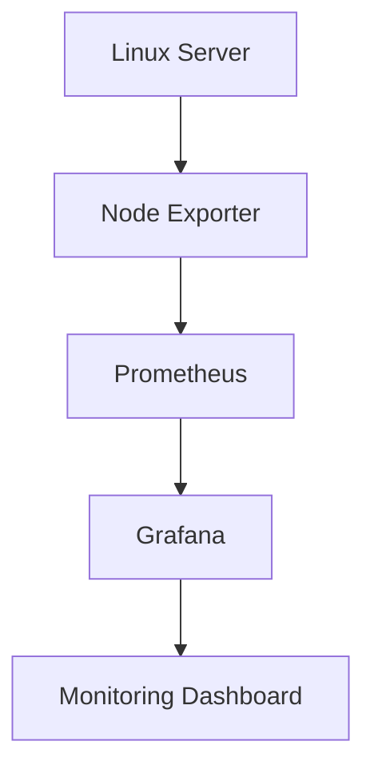
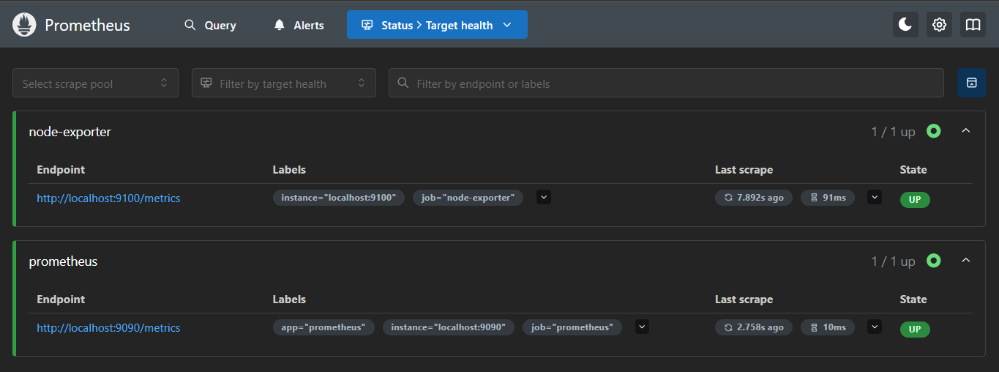
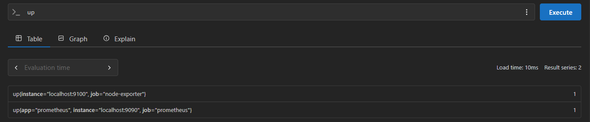

# 📊 Linux Monitoring with Prometheus & Grafana

<p align="center">


</p>

---

## 📌 Project Overview

This project demonstrates how to build a production-style Linux monitoring solution using **Prometheus**, **Node Exporter**, and **Grafana**.

The monitoring stack collects system metrics from a Linux machine using **Node Exporter**, stores them in **Prometheus**, and visualizes them through interactive **Grafana dashboards**.

---

## 🏗️ Architecture



---

## 🚀 Features

- Real-time Linux Monitoring
- CPU Utilization Monitoring
- Memory Monitoring
- Disk Usage Monitoring
- Filesystem Monitoring
- Network Monitoring
- Prometheus Metrics Collection
- Grafana Dashboards
- Infrastructure Observability

---

## 🛠️ Tech Stack

| Technology | Purpose |
|------------|---------|
| Linux (WSL) | Host System |
| Prometheus | Metrics Collection |
| Node Exporter | Linux Metrics Exporter |
| Grafana | Dashboard & Visualization |

---

## 📂 Project Structure

```text
prometheus-grafana-monitoring
│
├── prometheus
├── docs
├── screenshots
├── architecture
├── README.md
└── LICENSE
```

---

# 📸 Screenshots

## Prometheus Targets



---

## Prometheus Query



---

## Grafana Dashboard


---

## Grafana Data Source


---

## Grafana Service Status


---

# 📖 Installation

A complete installation guide is available here:

➡️ **[Installation Guide](docs/installation-guide.md)**

---

# 📚 Skills Demonstrated

- Linux Administration
- Prometheus Configuration
- Grafana Configuration
- Infrastructure Monitoring
- Metrics Collection
- Time-Series Monitoring
- Dashboard Visualization
- Linux Performance Monitoring

---

# 🎯 Learning Outcomes

✔ Installed and configured Prometheus

✔ Configured scrape targets

✔ Installed and configured Node Exporter

✔ Installed and configured Grafana

✔ Connected Grafana with Prometheus

✔ Built real-time infrastructure dashboards

---

# 🔮 Future Improvements

- Docker Compose deployment
- Kubernetes deployment
- Helm Charts
- Alertmanager integration
- Email Alerts
- Slack Notifications
- Multi-node Monitoring

---

## 👨‍💻 Author

**Tanmay Khatri**

GitHub: https://github.com/tanmaykexe

## 📄 License

This project is licensed under the MIT License.
